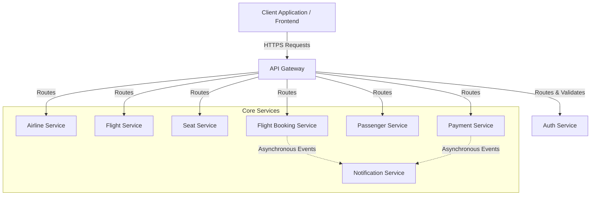

<div align="center">
  <h1>✈️ SkyBooker - Airline Management System</h1>
  <p><strong>A comprehensive, distributed microservices-based airline reservation platform.</strong></p>
  
  
  
  
  
  
</div>

---

## 📖 Overview

SkyBooker is an enterprise-grade airline management and reservation system built from the ground up using **Spring Boot microservices**. It provides a highly scalable and maintainable backend capable of handling real-world airline operations, including flight scheduling, real-time seat inventory, passenger management, and secure payment processing.

With centralized routing via an **API Gateway** and robust **JWT-based authentication**, SkyBooker is designed to be cloud-native, deployment-ready, and extensible.

---

## 🏗️ Architecture

SkyBooker employs a distributed microservices pattern. Each business domain is encapsulated within its own service, ensuring loose coupling and high cohesion.



---

## ✨ Key Features

- **Microservices Architecture:** 9 independent services (including API Gateway) communicating seamlessly.
- **Secure Authentication & Authorization:** JWT-based stateless auth with strict Role-Based Access Control (Admin, Staff, Passenger).
- **Dynamic Seat Inventory:** Real-time seat holding, releasing, and confirmation logic with distinct classes (Economy, Business, First Class).
- **Payment Processing:** Integrated workflow designed to support Razorpay and other payment gateways.
- **Event-Driven Notifications:** Asynchronous communication (via RabbitMQ/Events) for booking confirmations and payment updates.
- **Centralized Gateway:** Single entry point for routing, rate limiting, and global security policies.

---

## 🛠️ Technology Stack

| Category | Technologies |
| :--- | :--- |
| **Backend Framework** | Java 17+, Spring Boot 3, Spring Web, Spring Data JPA |
| **Security** | Spring Security, JWT (JSON Web Tokens), OAuth2 |
| **Database** | MySQL (Isolated databases per microservice), Hibernate |
| **Messaging & Events** | RabbitMQ |
| **API Architecture** | RESTful APIs, Spring Cloud Gateway |
| **Build & Deployment** | Maven, Docker |

---

## 📦 Microservices Breakdown

| Service | Description | Default Port |
| :--- | :--- | :--- |
| **Auth Service** | Handles user registration, JWT generation, and RBAC (Role-Based Access Control). | `8081` |
| **Flight Service** | Manages flight schedules, timings, source/destination mappings, and status. | `8082` |
| **Flight Booking** | Core orchestration service mapping passengers, seats, and payments to a booking. | `8083` |
| **Passenger Service** | Maintains passenger records, documents, and booking histories. | `8084` |
| **Payment Service** | Processes transactions, verifies payments (e.g., Razorpay), tracks status. | `8085` |
| **Seat Service** | Controls real-time seat inventory, holds, pricing, and availability. | `8086` |
| **Airline Service** | Manages airline data, IATA/ICAO codes, and fleet metadata. | `8087` |
| **Notification Service** | Sends automated emails/alerts triggered by system events (bookings, payments). | `8088` |
| **API Gateway** | Entry point routing all traffic to appropriate downstream services securely. | `8080` |

---

## 🔄 The Booking Workflow

1. **Authentication:** User logs in and receives a JWT.
2. **Search:** User queries available flights based on route and date (`Flight Service`).
3. **Select:** User selects a flight and views available seats (`Seat Service`).
4. **Hold:** User locks in selected seats to prevent double-booking.
5. **Passenger Info:** User inputs passenger details (`Passenger Service`).
6. **Payment:** User completes the transaction (`Payment Service`).
7. **Confirm:** `Flight Booking Service` finalizes the reservation and links all entities.
8. **Notify:** `Notification Service` dispatches a confirmation email.

---

## 🚀 Getting Started

### Prerequisites
- **Java 17** or higher installed.
- **Maven** (or use the included wrapper).
- **MySQL Server** running locally or via Docker.
- **RabbitMQ** (optional depending on active profile, required for full event-driven flow).

### 1. Clone the Repository
```bash
git clone https://github.com/your-username/SkyBooker-Airline-Management-System.git
cd SkyBooker-Airline-Management-System
```

### 2. Environment Configuration
SkyBooker uses environment variables for secure configuration. 
1. Copy `.env.example` to `.env` in the root directory.
2. Update the credentials, specifically your database username/password, JWT secret, and SMTP settings.

### 3. Database Initialization
Ensure you have created the respective schemas in your MySQL server before launching the services:
```sql
CREATE DATABASE skybooker_auth_db;
CREATE DATABASE skybooker_flight_db;
CREATE DATABASE skybooker_booking_db;
CREATE DATABASE skybooker_passenger_db;
CREATE DATABASE skybooker_payment_db;
CREATE DATABASE skybooker_seat_db;
CREATE DATABASE skybooker_airline_db;
```

### 4. Running the Application
Since this is a microservices architecture, you must run the services independently or use an IDE (like IntelliJ IDEA with Run Dashboards) to launch them simultaneously. 

*Always start the **Auth Service** and **API Gateway** first.*

Using Maven:
```bash
cd auth-service
mvn spring-boot:run
```
*(Repeat for the remaining services in new terminal tabs or background processes.)*

---

## 🐳 Docker & Cloud Deployment
The system architecture is cloud-ready. You can containerize the microservices using Docker and deploy them to platforms like Render, AWS, Azure, or Kubernetes clusters.

## 📄 License
This project is open-source and created for educational and developmental purposes.

---
<div align="center">
  <i>Designed and developed with ❤️ for scalable aviation tech.</i>
</div>
